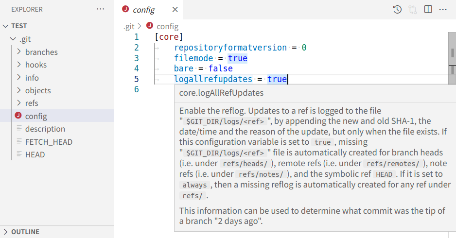
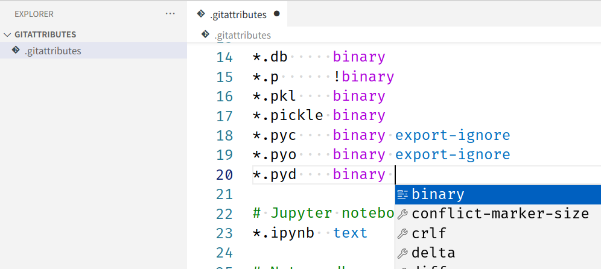

# git-config Language Server
Intellisense for .gitconfig and .gitattributes files.

.gitconfig\

.gitattributes\

## Features
- [x] Documentation on hover
- [x] Syntax highlighting
- [x] Auto-completion
- [x] Code Formatter
